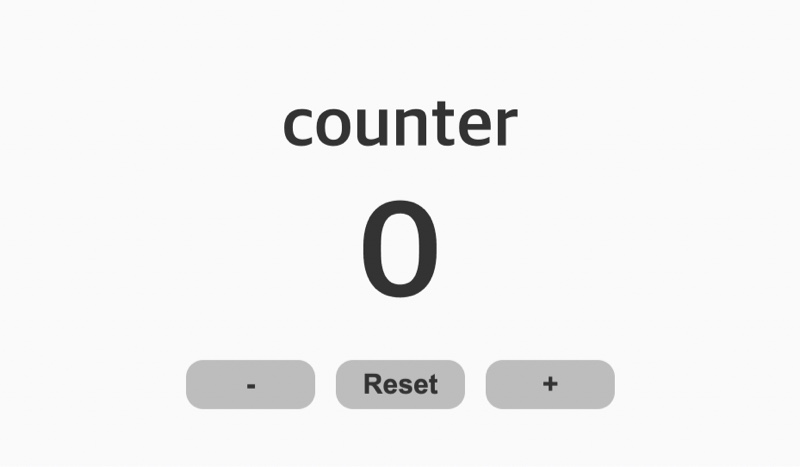

 
 

  

<h2 align="middle">UI Counter</h2>

테스트 코드 작성을 연습하기 위한 초간단 Counter 미션

  
  
  
  
  

## 🔥 Projects!

  

  <a href="https://blackcoffee-study.github.io/js-counter-test/">🖥️ 데모 링크</a>

counter라는 간단한 미션을 통해서 Cypress라는 E2E 도구에 익숙해져보세요. 아래의 간단한 기능을 구현하면 쉽게 Cypress도구를 사용해보실 수 있습니다.

- [ ] counter의 초기값은 0이다.
- [ ] + 버튼을 클릭 시 count가 1증가한다.
- [ ] - 버튼을 클릭 시 count가 1감소한다.
- [ ] + 버튼을 클릭 시 count가 10이 넘는 경우 더이상 증가하지 못한다. (Max 값이 10)
- [ ] - 버튼을 클릭 시 count가 0보다 작아지는 경우 감소하지 못한다. (Min 값이 0)
- [ ] reset 버튼을 클릭 시 counter가 0으로 초기화된다.

## 👏🏼 Contributing

만약 미션 수행 중에 개선사항이 보인다면, 언제든 자유롭게 PR을 보내주세요.

 

## 🐞 Bug Report

버그를 발견한다면, [Issues](https://github.com/blackcoffee-study/js-counter-test/issues)에 등록해주세요.

 

## 📝 License

This project is [MIT](https://github.com/blackcoffee-study/js-counter-test/blob/main/LICENSE) licensed.
